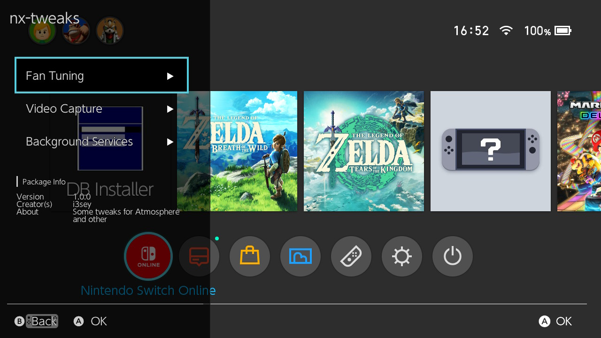
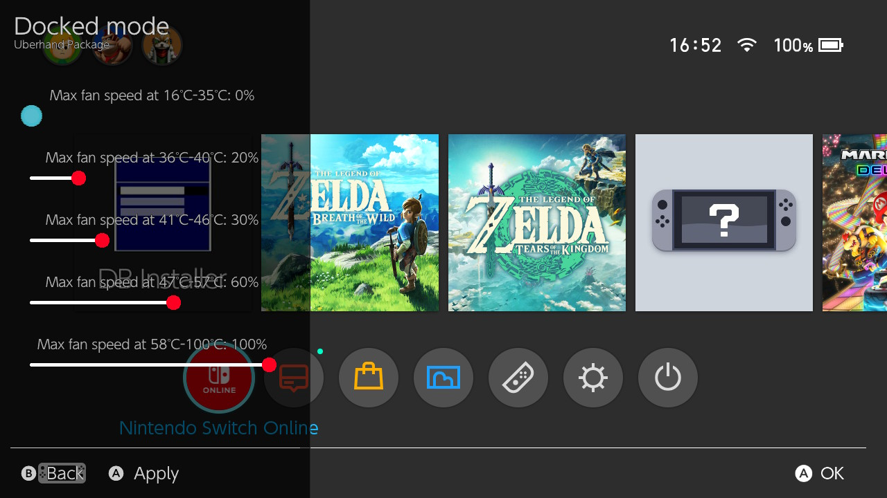
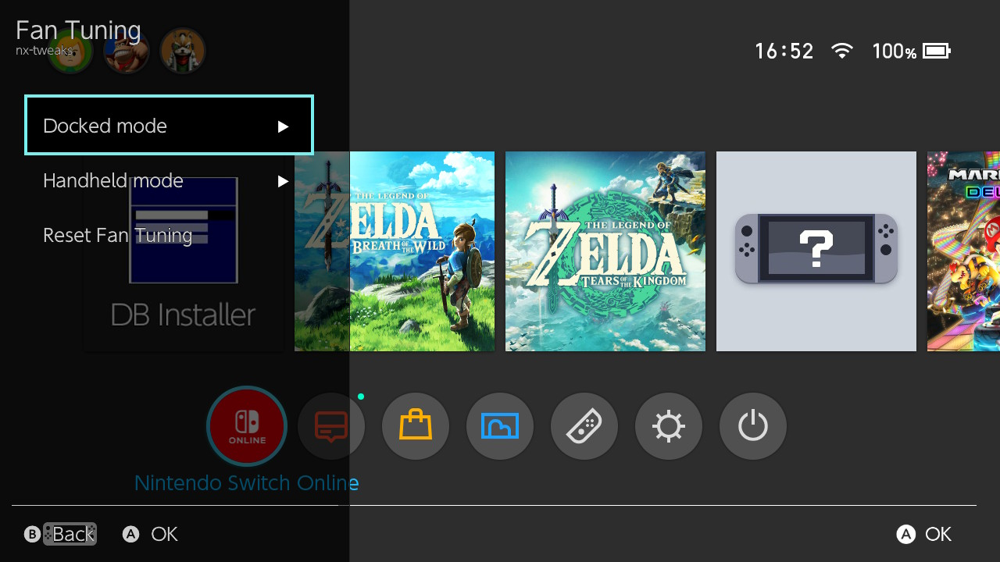
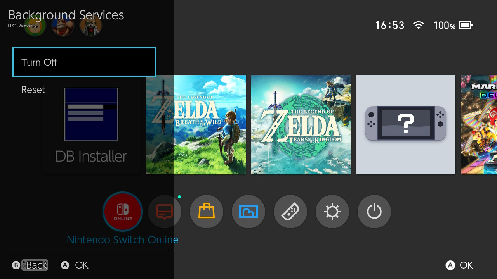

# nx-tweaks
Uberhand package for tuning Atmosphere and other

  
  
Screenshot

  
  

## Features:
### Fan Tuning
* Fan curve is adjusted by sliders
* Settings for the dock mode and for the portable mode are separated

  
  
Screenshots

  
  
  

### Video capture settings
You can adjust FPS, bitrate and count of I frames

  
  
Screenshot

  
  

### Disabling Background Services
* For power saving in standby mode
* Do NOT add this if online service is in use.
* You can't delete user trough hos, use DBI or Goldleaf instead.

  
  
Screenshot

  
  

